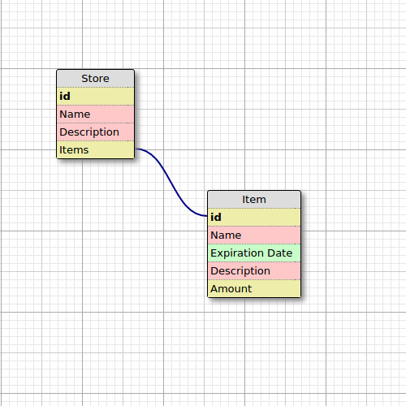

# Nourish
This application serves to allow users to keep track of items in their kitchen. This application is still in development.

#Current Features
- Users can create a store that will serve to hold items; users can add a title and description to store
- Users can add items to each store; each item can hold a name, description, expiration date, and amount left value.

#Future Features
- Notifications of expiring items
- Smart grocery list
- User authentication with persisted profiles/stores

#Schema

